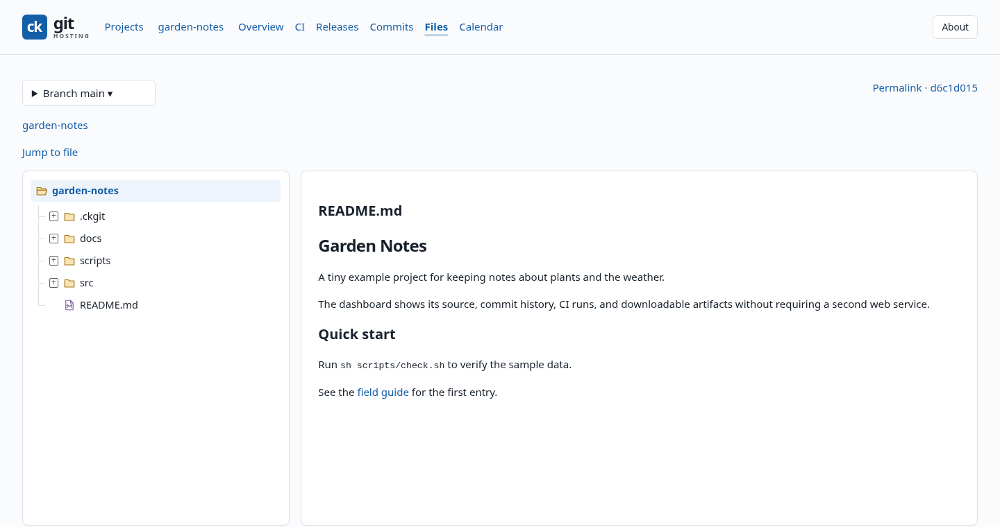

# ck-git-hosting

**Private Git hosting for your own server.**

Publish, clone, and sync projects with `ckgit`. Browse source, commit history,
and CI results in the web dashboard. Host Markdown documentation with `ckdocs`.
Repositories use standard Git and OpenSSH on Debian, including Raspberry Pi.

[Install the server](docs/operations/01-installation.md) ·
[Set up a device](docs/guides/client-setup.md) ·
[Explore the dashboard](docs/operations/08-web-dashboard.md)



## Start with a project

After [installing and pairing your device](docs/guides/client-setup.md):

```sh
ckgit setup --server ckgit@server --client-id laptop --web-host server
ckgit doctor
cd ~/code/my-project
ckgit publish
ckgit web
```

Replace `server` with your SSH host and `laptop` with your paired device ID.
`publish` previews the changes and asks for confirmation.

## What would you like to do?

| Task | Guide |
|---|---|
| Bring projects to your server | [Publish and sync](docs/guides/publish-and-sync.md) |
| Work from another device | [Clone and update](docs/guides/clone-and-update.md) |
| Choose or repair a local checkout | [Manage checkouts](docs/guides/manage-checkouts.md) |
| Browse files, commits, and build results | [Dashboard tour](docs/operations/08-web-dashboard.md) |
| Run automated builds | [Continuous integration](docs/operations/04-ci-cd.md) |
| Follow builds and get release packages | [Builds and releases](docs/guides/ci-and-releases.md) |
| Publish documentation and Mermaid diagrams | [Get started with ckdocs](docs/operations/07-docs-sites.md) |
| Protect or recover your repositories | [Backup and recovery](docs/operations/03-backup-and-recovery.md) |

## Reference and administration

- [Client commands](docs/reference/commands.md)
- [Server installation and upgrades](docs/operations/01-installation.md)
- [Packages and releases](docs/operations/02-packages-and-releases.md)
- [Build from source](docs/reference/build-and-test.md)
- [SSH and control protocol](docs/protocol/01-ssh-and-control-v1.md)

[Read the online documentation](https://cklukas.github.io/ck-git-hosting/).
Licensed under the [MIT License](LICENSE).
