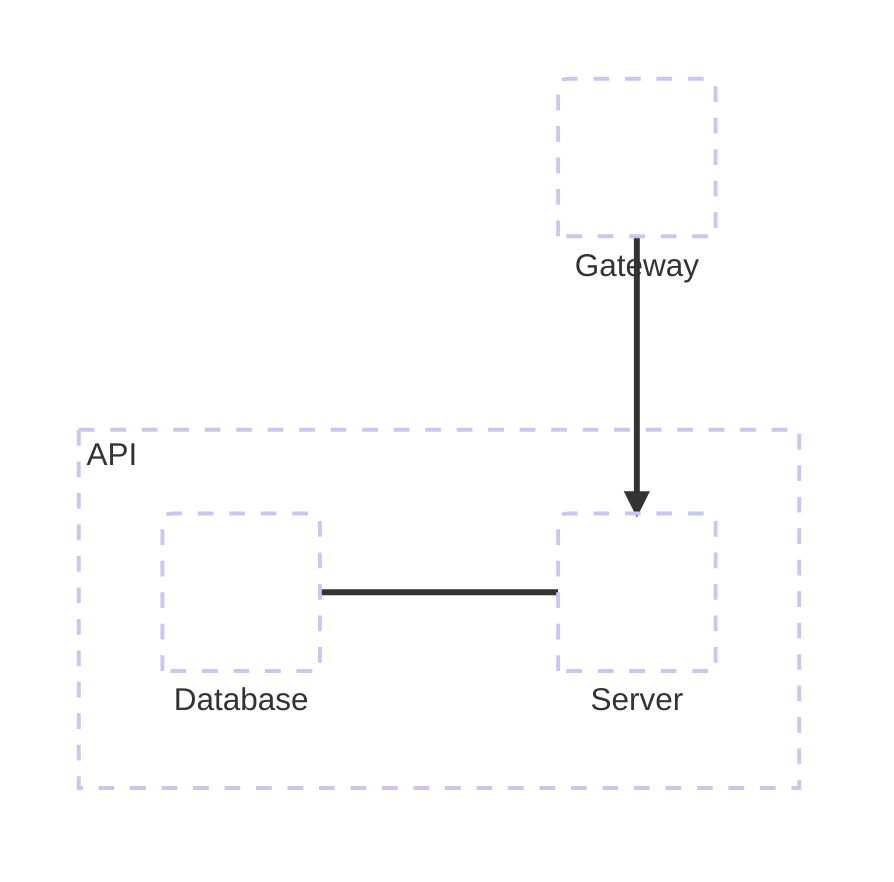

# Architecture

[All diagram examples](../mermaid.md#diagram-examples)


**Source**

````markdown

```mermaid
architecture-beta
    group api[API]
    service db[Database] in api
    service server[Server] in api
    service gateway[Gateway]
    db:R -- L:server
    gateway:B --> T:server
```
````

**Diagram**


```mermaid
architecture-beta
    group api[API]
    service db[Database] in api
    service server[Server] in api
    service gateway[Gateway]
    db:R -- L:server
    gateway:B --> T:server
```
