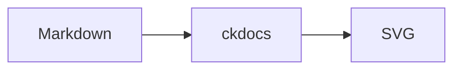

# Mermaid diagrams

A fenced code block with the language `mermaid` becomes a standalone SVG
image during `build`, `check`, and `serve`. Rendering is built into ckdocs;
there is no browser script, network request, or external rendering tool.
The HTML selects a light or dark SVG to match the reader's colour scheme.
Repeated diagrams share their generated assets under `_ckdocs-mermaid/`,
a reserved output directory. The site works offline and under URL prefixes.

Write a diagram like this:

````markdown

````

ckdocs supports **23 Mermaid diagram types**. Each example below includes
complete, copyable source and the rendered diagram.
Not every Mermaid.js directive is supported. Unsupported
constructs produce diagnostics instead of disappearing silently. A fatal
rendering error leaves the escaped source visible. Reports name the page,
diagram number, and parser line where available. A normal build exits `3`
with warnings; `check` and `--strict` exit `1`.

Each diagram is limited to 64 KiB of source, 1024 lines, and 4 MiB per SVG.
A page can contain 128 diagrams; a site can contain 1024 distinct diagrams.
SVG text uses the reader's installed fonts. Images are static: JavaScript
callbacks and interactive links inside the image are unavailable.

## Diagram examples

Choose a diagram to view its source and result.

### Flows and systems

- [Flowchart](diagrams/flowchart.md)
- [Mindmap](diagrams/mindmap.md)
- [Block diagram](diagrams/block-diagram.md)
- [Architecture](diagrams/architecture.md)
- [C4 diagram](diagrams/c4-diagram.md)
- [Packet diagram](diagrams/packet-diagram.md)

### Software models

- [Class diagram](diagrams/class-diagram.md)
- [State diagram](diagrams/state-diagram.md)
- [Entity-relationship](diagrams/entity-relationship.md)
- [Requirement diagram](diagrams/requirement-diagram.md)

### Sequences

- [Sequence diagram](diagrams/sequence-diagram.md)
- [ZenUML sequence](diagrams/zenuml-sequence.md)

### Charts

- [Pie chart](diagrams/pie-chart.md)
- [XY chart](diagrams/xy-chart.md)
- [Radar chart](diagrams/radar-chart.md)
- [Quadrant chart](diagrams/quadrant-chart.md)
- [Sankey diagram](diagrams/sankey-diagram.md)
- [Treemap](diagrams/treemap.md)

### Planning and history

- [Gantt chart](diagrams/gantt-chart.md)
- [Timeline](diagrams/timeline.md)
- [User journey](diagrams/user-journey.md)
- [Kanban board](diagrams/kanban-board.md)
- [Git graph](diagrams/git-graph.md)
