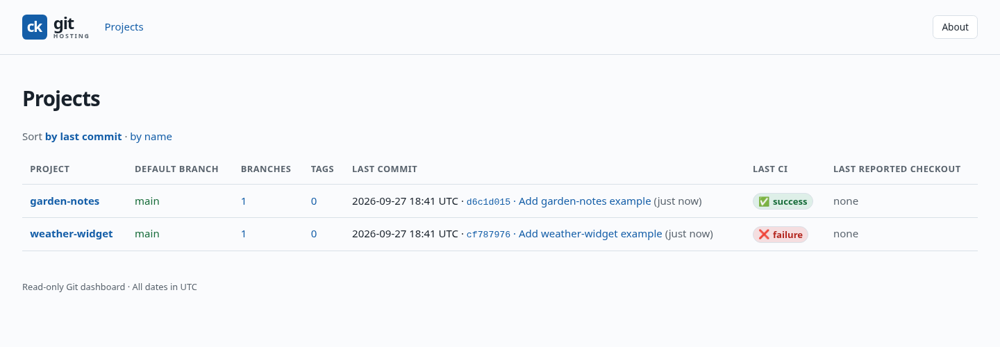
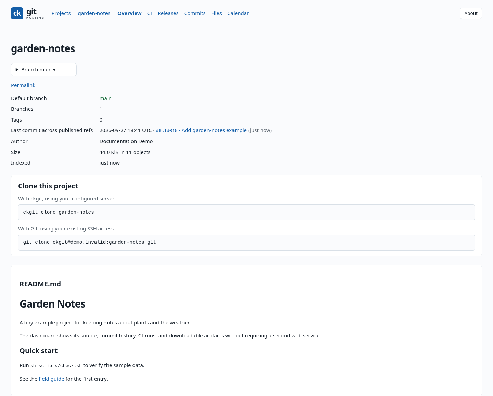
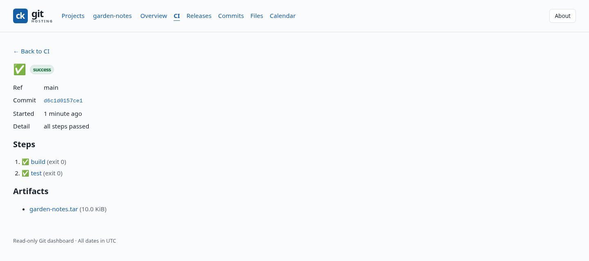

# Web dashboard tour

The dashboard is a small web view of the Git repositories hosted by
ck-git-hosting. It shows project activity, source files, commit history, and
continuous integration without a separate database or web application.

These screenshots are captured from the real `ck-git-hostingd` frontend during
the documentation build. The projects below are disposable examples made by
the [screenshot fixture](../../scripts/docs-web-screenshots.sh); they are not
repositories from the server running the documentation site.

## Projects at a glance

The project list shows the default branch, most recent commit, and latest CI
result for each hosted repository. The two example projects include one
successful run and one deliberately failing test.

## Project overview

Open a project to see its branches, latest commit, clone commands, and rendered
README. The Git clone address in this example uses `demo.invalid` deliberately.

## Browse source and documentation

The Files view has a navigable tree alongside the selected file. Markdown files
render in place; source files can be opened with line numbers and syntax
highlighting.

## Follow a CI run

A run page shows the branch, commit, result of each workflow step, and artifacts.
Each step links to its captured log. The demo's `build` and `test` steps ran
through the actual CI runner before this screenshot was taken.

The dashboard binds to loopback by default. To view your own projects through
an SSH tunnel, see [Open the dashboard](01-installation.md#open-the-dashboard).
